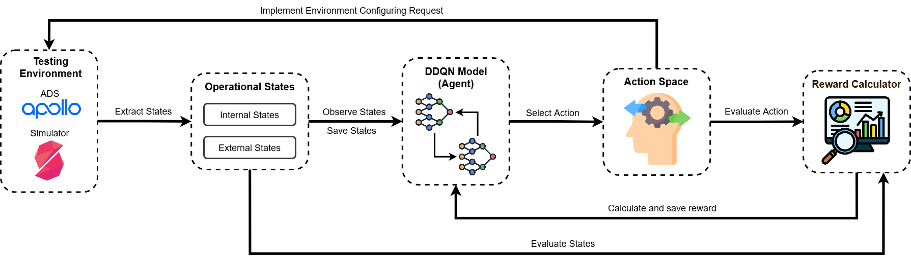

<div align="center">

# CRISIS: Generating Critical Scenarios for Testing Automated Driving Systems
[](https://opensource.org/licenses/MIT) [](https://www.python.org/downloads/release/python-31012/) 
</div>

## Introduction

In this paper, we propose CRISIS, a Reinforcement Learning (RL)-based approach to generate realistic critical scenarios for testing ADSs.
To comprehensively capture the complexity of driving scenarios, CRISIS holistically represents the environment by both the **internal states** of the ADS and the **external states** of the surrounding factors. 
CRISIS trains the RL agent to effectively configure the environment that places the AV in dangerous situations and potentially leads it to collisions. 
We introduce a diverse set of actions that allows the RL agent to systematically configure both **environmental conditions** and **traffic participants**.
Additionally, we enforce heuristic constraints to ensure the realism and relevance of the generated test scenarios.

CRISIS is evaluated on two popular simulation maps with four road configurations. The experimental results demonstrate its ability to outperform the state-of-the-art approach, DeepCollision, by generating 40\% to 110\% more collision scenarios. Furthermore, compared to Random Search, CRISIS achieves up to 250\% better performance. These results highlight the effectiveness of CRISIS in enhancing the safety testing of AVs through realistic comprehensive scenario generation.

## The architecture


CRISIS leverages a Double Deep-Q Network (DDQN) to train an RL agent that can observe both the ADS **internal states** and surrounding **external states** to select optimal actions to configure the environment. 

At each time step $t$, based on the observed state $s_t$, the agent selects an action $a_t$. Upon executing $a_t$ and the ADS operates within a fixed observation-time period (OTP), the operating environment is transitioned into a new state $s_{t+1}$. The agent then evaluates the effectiveness of the chosen action by calculating a reward based on the **collision probability**, reinforcing actions that lead to more critical scenarios. 

Moreover, to effectively train the DDQN model, a **Replay Buffer** is employed in the training process. Specifically, at each time step $t$, the transition  $\langle s_t, a_t, s_{t+1} \rangle$ along with its corresponding reward $r_t$ is stored into the buffer. When the Replay Buffer reaches its capacity, the transitions and rewards are prioritized using the Prioritized Experience Replay (PER) algorithm, which ensures that high-priority transitions are selected to train the DDQN model.


# Project Overview

## Project Structure

1. **[configuration_api_server](https://github.com/trunghieu1109/MoViTe/tree/reconstruct_project/configuration_api_server)** - The API server provides RESTful API endpoints to directly configure the testing environment and create a scenario.

2. **[crisis_model_pipeline](https://github.com/trunghieu1109/MoViTe/tree/reconstruct_project/crisis_model_pipeline)** - The entire pipeline for training a Reinforcement Learning Agent and conducting experiments on various maps of CRISIS.

3. **[scenario_evaluation](https://github.com/trunghieu1109/MoViTe/tree/reconstruct_project/scenarios_evaluation)** - Evaluations of the training process and experiments.

4. **[restful_api](https://github.com/trunghieu1109/MoViTe/tree/reconstruct_project/restful_api)** - List of RESTful API endpoints used to configure the environment.

5. **[PythonAPI](https://github.com/trunghieu1109/MoViTe/tree/reconstruct_project/PythonAPI)** - Python API used to interact with the LGSVL simulator. 

## Prerequisite

### Prepare Testing Environment
First, we should set up the testing environment, including the Apollo autonomous vehicle system and the LGSVL simulator.

#### Apollo ADS

Install the Apollo system following the instructions provided in the developer's **[GitHub repository](https://github.com/ApolloAuto/apollo)**. For example, you can install Apollo 7.0 following these steps:

```bash
git clone https://github.com/ApolloAuto/apollo.git
cd apollo
git checkout r7.0.0

cd ./docker/scripts/dev_start.sh 
cd ./docker/scripts/dev_into.sh

./apollo.sh build_opt_gpu

./scripts/bootstrap_lgsvl.sh
```

#### LGSVL Simulator

First, we need to deploy a cloud server to provide assets to the simulator via an API. The installation details are described in the **[SORA-SVL](https://github.com/YuqiHuai/SORA-SVL)** GitHub Repository.

Next, download the simulator from the **[LGSVL](https://github.com/lgsvl/simulator/releases/tag/2021.3)** GitHub repository and use it.

#### Libraries


```bash

# run this command to install lgsvl libraries
python3 -m pip install -r ./PythonAPI/requirements.txt --user .

# run this command to install remaining libraries
python3 -m pip install -r requirements.txt --user .
```

## Quickstart

Run the following command to deploy the API server to provide APIs for environment configuration:

```bash
python3 ./configuration_api_server/crisis_api_server.py
```

Then, run the following command to train the model:

```bash
python3 ./crisis_model_pipeline/crisis_training_model.py
```

Finally, run the following command to user the model and generate testing scenarios:

```bash
python3 ./crisis_model_pipeline/crisis_experiment.py
```

# Contact us
If you have any questions, comments or suggestions, please do not hesitate to contact us.
- Email: 21020017@vnu.edu.vn

# License
[MIT License](LICENSE)